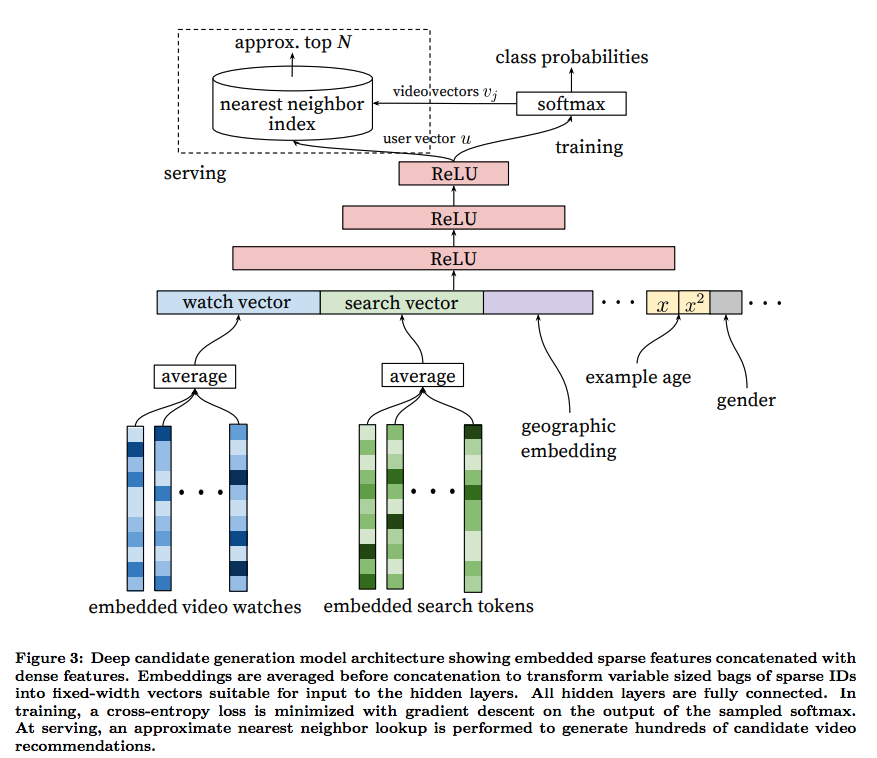
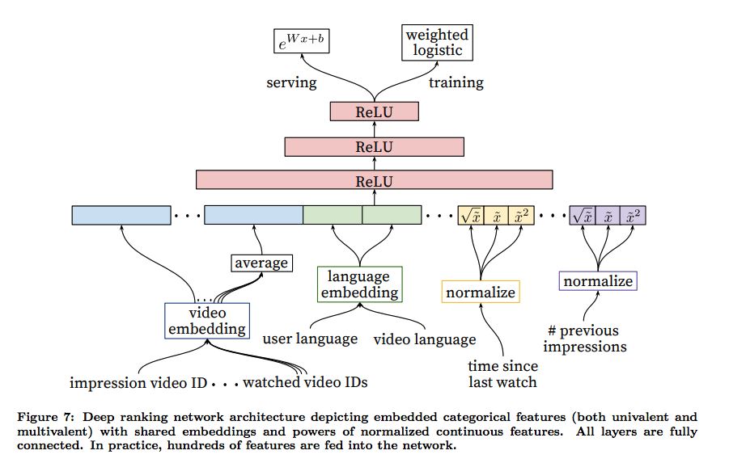
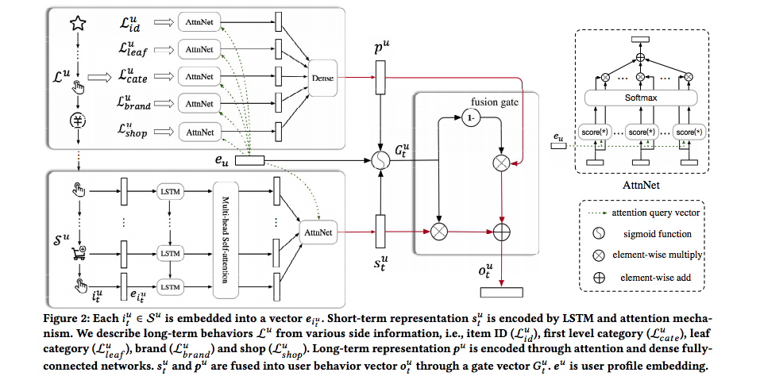
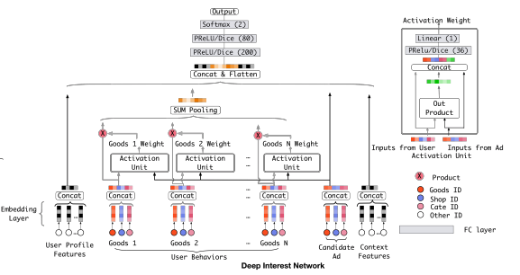
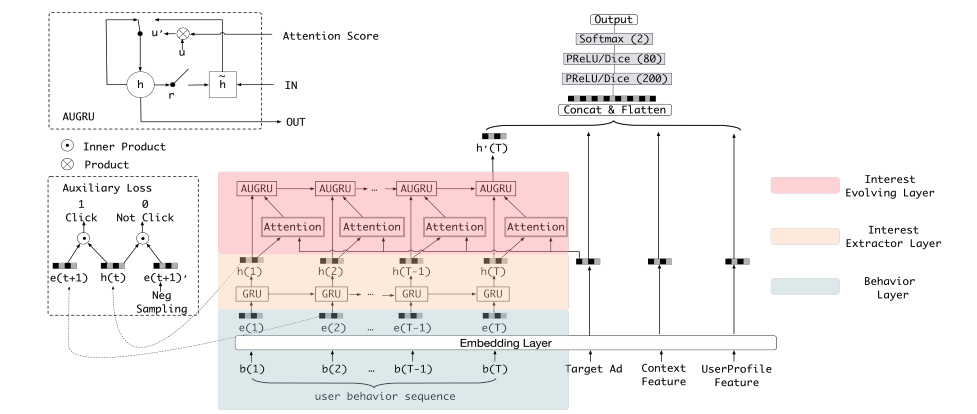

# Recommender System Paper

Survey: [Deep Learning based Recommender System: A Survey and New Perspectives (ACM Computing Surveys)](https://arxiv.org/pdf/1707.07435.pdf)

## Candidate Generation

The general idea of candidate generation is to pre-filter candidates from a huge number (millions to billions) to an acceptable number (<1000) so that the later ranking stage is able to handle the data volume during online serving. 

In the early years, the typical approach for candidate generation is through heuristic or collaborative filtering, those methods requires too many manual work and is unable to handle data sparsity issue. In recent years, representation learning is emerging and the state-of-art candidate generation is through embedding dot product, e.g. $score = e_u \dot e_i$, where $e_u$ is the embedding of the user and $e_i$ is the embedding of the candidate. For retrieve $e_i$, similarity search approaches are leveraged like [FAISS](https://engineering.fb.com/data-infrastructure/faiss-a-library-for-efficient-similarity-search/).

|  Year | Category  | Title  |  
|---|---|---|
| RecSys2016 | DNN | [Deep Neural Networks for YouTube Recommendations](#recsys2016) |
| CIKM2019 | Sequential deep matching | [SDM: Sequential Deep Matching Model for Online Large-scale Recommender System](#cikm2019) |
| CIKM2019 | Multi-interest modeling | [Multi-Interest Network with Dynamic Routing for Recommendation at Tmall](#cikm2019-2) |

### <a id="recsys2016">[Deep Neural Networks for YouTube Recommendations](https://static.googleusercontent.com/media/research.google.com/en//pubs/archive/45530.pdf)

This paper briefly introduces the system architecture of the Youtube recommendation in 2016, which includes the candidate generation component and the ranking component for the online part, and then training data preparing and model training for the offline part.

**Candidate generation**: The candidate generation is formulated as a classification problem that estimate the watch probability of a candidate video i, user info U, and the context C, i.e. $P(i | U, C) = \frac{e^{v_iu}}{\sum_{j \in V} e^{v_j u}}$, where $u$ is the embedding of the user, context pair and $v_j$ is the embedding of the candidate video. 

The training data is collected in and out of the recommendation pages. This is because it is important to quickly surface new video contents into recommendation. Additionally, each user would have a fixed number of training samples to weighting users equally in the loss function. To speed up the model training, negative sub-sampling strategy is used for weight update and the loss is minimized for the true label and the sampled negative classes. For model serving, approximate scoring is leveraged. The dot product between the user embedding ant the video embedding is essentially similarity search.

    

**Ranking**: A similar DNN architecture is leveraged, but with more features, including impression video embedding, language embedding (user language and video language) and many temporal related features. All categorical features are represented as embeddings and the continuous features are normalized.

    

### <a id="cikm2019">[SDM: Sequential Deep Matching Model for Online Large-scale Recommender System](https://arxiv.org/pdf/1909.00385.pdf)

Proposed the sequential deep matching model that leverages both the short term user behavior and long term user behavior to learn the user representations for candidate matching. The short term user behavior indicates the latest m user actions and the long term user behavior are the ones happened with the past 7 days before the short term behavior. 

Each item in both of the short term sequence and the long term sequences are represented by one-hot encoding and transformed by the embedding layer. For short term behavior, the embeddings are feed to the LSTM with multi-head self-attention. The long term user behavior are described in various perspectives: id, leaf category, category, brand, and shop. Then an attention score is calculated based on these perspectives with respect to the user profile embedding. Finally, the short term representation are fused with the long term representation with a specifically designed gate.

    

### <a id="cikm2019-2">[Multi-Interest Network with Dynamic Routing for Recommendation at Tmall](https://arxiv.org/pdf/1904.08030.pdf)

## Ranking

|  Year | Category  | Title  |  
|---|---|---|
| RecSys2010 | System | [The YouTube Video Recommendation System](#recsys2010) |
| ADKDD2014	  | System  | [Practical lessons from predicting clicks on ads at facebook](#adkdd2014)  |
| CIKM2015  | CNN  | [A Convolutional Click Prediction Model](#cikm2015)  |
| ECIR2016  | FM Neural Nets  | [Deep Learning over Multi-field Categorical Data: A Case Study on User Response Prediction](#ecir2016)  | 
| ICDM2016  | Product-based NN | [Product-based neural networks for user response prediction](#icdm2016)  |
| DLRS2016  | Wide & Deep  | [Wide & Deep Learning for Recommender Systems](#dlrs2016) |
| IJCAI2017 | DeepFM  | [DeepFM: A Factorization-Machine based Neural Network for CTR Prediction](#ijcai2017) |
| ADKDD2017 | Deep&Cross NN | [Deep & Cross Network for Ad Click Predictions](#adkdd2017) |
| IJCAI2017-2 | Attentional FM | [Attentional Factorization Machines: Learning the Weight of Feature Interactions via Attention Network](#ijcai2017-2) | 
| KDD2018 | Adaptive user interest with local activation | [Deep Interest Network for Click-Through Rate Prediction](#kdd2018) |
| AAAI2019 | Latent and evoluted user interest | [Deep Interest Evolution Network for Click-Through Rate Prediction](#aaai2019) | 

### <a id="recsys2010">[The YouTube Video Recommendation System](https://www.researchgate.net/profile/Sujoy_Gupta2/publication/221140967_The_YouTube_video_recommendation_system/links/53e834410cf21cc29fdc35d2/The-YouTube-video-recommendation-system.pdf)

A really early paper described the system architecture of the Youtube recommender system. The candidate generation is based on the BFS on the graph constructed by the video co-visiting. The ranking stage is a simple linear model based on the signals of video quality and user specificity. The final blending stage considers the diversity of the videos by limiting the number of videos per category.

### <a id="adkdd2014">[Practical lessons from predicting clicks on ads at facebook](http://citeseerx.ist.psu.edu/viewdoc/download?doi=10.1.1.718.9050&rep=rep1&type=pdf)

* Leverage boosting tree for feature transform and feed to linear model.
* Use online data joiner to keep training data fresh.
* The importance of features are quantified as the total squared error reduction in the boosting tree.

    

### <a id="cikm2015">[A Convolutional Click Prediction Model](http://ir.ia.ac.cn/bitstream/173211/12337/1/A%20Convolutional%20Click%20Prediction%20Model.pdf)
Proposed the convolution click prediction model by leveraging the sequential behavioral information of the users. Each of the ad impression in the sequence is represented as an embedding $e_i$. Several convolution operations are applied to the input matrix $s$, then flexible pooling followed by another conv, pooling and finally a full connected layer.

    

### <a id="ecir2016">[Deep Learning over Multi-field Categorical Data: A Case Study on User Response Prediction](https://arxiv.org/pdf/1601.02376.pdf)

Proposed two model architectures, Factorization-machine supported Neural Network (FNN) and Sampling-based Neural Networks (SNN) to model the relationship of multi-fied categorical features beyond linearality. These two models are similar for most of the parts except the first 2 layers (input and first hidden). The categorical features are represented as one-hot encodings. 

For FNN, the first hidden layer neurons are only connected locally with the corresponding inputs in one field. This is to learn a low dimension representative of each category in a way similar to embeddings.

For SNN, the input layer and the first hidden layer are fully connected. Due to the hugh parameters between the first and second layers. The paper proposed two pre-training methods to learn the weights: sampling-based Restricted Boltzmann Machine (RBM) and sampling-based Denoising Auto-Encoder.

In summary, the major contribution of this paper is the proposed representative learning for the multi-field categorical features, including FM-like NN and RBM-NN and DAE-NN. All the three methods are aiming to effectively learn a low dimensional representative of the hugh input feature space.

    
    

### <a id="icdm2016">[Product-based neural networks for user response prediction](#icdm2016)

This is one paper focused on the representation learning of the input features before feeding to the neural nets. An embedding layer is leveraged to learning the dense representation (embedding) of the interactive patterns between intern-field categorical features. This embedding layer is used as the first layer of an architecture called Product-based Neural Networks (PNN) for end-to-end recommendation.

    

The model architecture proposed in this paper is an incremental updating from the architecture proposed in the [FNN](#ecir2016) paper. Instead of doing pre-training for the first hidden layer, PNN added the embedding layer to learn the low level representation of the input features.

### <a id="dlrs2016">[Wide & Deep Learning for Recommender Systems](https://arxiv.org/pdf/1606.07792.pdf)

This paper proposed a new model architecture for the recommender systems, wide & deep. The wide part and deep part are feed to one common logistic loss function and are trained jointly.

The wide part is a linear model that learns the relationship between features using cross-product, acting as the memorizer of the system. The features feed to the linear model include raw input features and transformed features, e.g. cross-product transformation.

The deep part is a DNN model that tries to learn a general representation of the input features.

    

### <a id="ijcai2017">[DeepFM: A Factorization-Machine based Neural Network for CTR Prediction](https://www.ijcai.org/Proceedings/2017/0239.pdf)

This paper proposed a model called DeepFM that natively integrate FM with DNN that provides and e2e CTR prediction. DeepFM has the advantages of capturing both the low-level feature interactions (dot-product) like FM and capturing the high-level feature interactions like DNN, without manually crafted feature engineering like other model architectures.

In summary, this paper combines the architecture of FNN and Wide&Deep by replacing the Wide part with PNN. Another change is that instead of directly feeding the raw features to the FM layer, it feeds the raw features to the embedding layer. Then the output of embedding layer would be shared by the FM and the DNN.

    

### <a id="adkdd2017"> [Deep & Cross Network for Ad Click Predictions](https://arxiv.org/pdf/1708.05123.pdf)

This paper proposed Deep & Cross Network that integrate the traditional DNN with a Cross-network. The network is able to learn the feature interactions at a certain bounded degree, to achieve efficiency advantages over the traditional DNN.

From the architecture perspective, this paper is a variant of FM NN and the Wide & Deep NN. It replaced the Wide part with stacked crossed network that each layer is a cross product of the output of the previous layer and the embedding and stacking layer. This make the network to be able to learn the lth-degree cross product of the input features.

    

### <a id="ijcai2017-2"> [Attentional Factorization Machines: Learning the Weight of Feature Interactions via Attention Networks](https://www.ijcai.org/Proceedings/2017/0435.pdf)

This paper proposed the attentional FM to address the issue of negative impact of noisy feature interactions of the vanilla FM. Essentially, an attention network (MLP) is added and provides extra weights to quantify the importance of each of the pairwise feature interactions. $\hat{y} = \sum_{(i,j)\in R_x} a_{ij}(v_i \odot v_j)x_i x_j$, where $a_{ij}$ is the weight of the interactions obtained by feeding the interactions of feature i, j to the attention network, i.e. $a'_{ij} = h^T ReLU(W (v_i \odot v_j) x_i x_j + b)$ and $a_{ij} = softmax(a'_{ij})$.

From the model training perspective, in addition to learn the weights of the FM, the weights of the attention network
also needs to be learnt.

    

### <a id="kdd2018"> [Deep Interest Network for Click-Through Rate Prediction](https://arxiv.org/pdf/1706.06978.pdf)

Proposed the Deep Interest Network (DIN) that adaptively calculate the representation vector of user interests by taking into consideration of the relevance between historical behaviors and the current recommended candidate, with the introduction of the local activation unit. Additionally, this paper proposed the mini-batch aware regularizer and a data adaptive activation function to ease the model training.

For each of the feature groups (one-hot encoding or multi-hot encodings of the same feature), embeddings are learned and then pooled (sum/avg pooling for each of the embedding vectors transformed from the multi-hot encoding) so that each feature group would have one embedding vector. The user behavior embedding vectors are then weighted summed according to its relevance to the candidate ad via the activation units, i.e. $v_u(A) = f(v_a, e_1, e_2, ..., e_H) = \sum_{j=1}^H a(e_j, v_a)e_j$, where H is the number of such feature groups and $a(\dot)$ is the activation unit in form of feed-forward NN with output as the weight.

    

### <a id="aaai2019"> [Deep Interest Evolution Network for Click-Through Rate Prediction](https://arxiv.org/pdf/1809.03672.pdf)

Proposed the Deep Interest Evolution Network (DIEN) to learn the latent user interests from the explicit user behaviors (e.g. sequence of actions). Additionally, it can capture the temporal dynamics of the user interest evolution with the proposed the interests extractor layer with AUGRU, a GRU with the attention update gate ($\tilde{u}_t = a_t \cdot u_t$ where $a_t = \frac{exp(h_tWe_a)}{\sum_{j=1}^T exp(h_jWe_a)}$, and then $h_t = (1 - \tilde{u}_t) h_{t-1} + \tilde{u}_t \tilde{h}_t$. Additionally, it leverages the auxiliary loss function that explicitly calculate the loss for each of the hidden states to achieve better representation learning. Combined with the attention mechanism, the evolves of multiple interests can be captured and decomposed separately.

    

