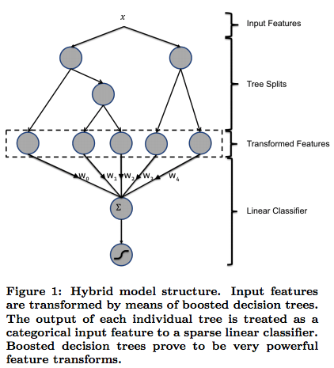
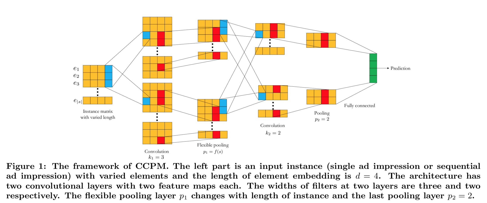
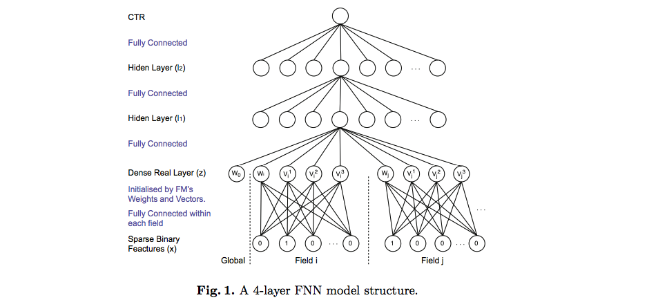
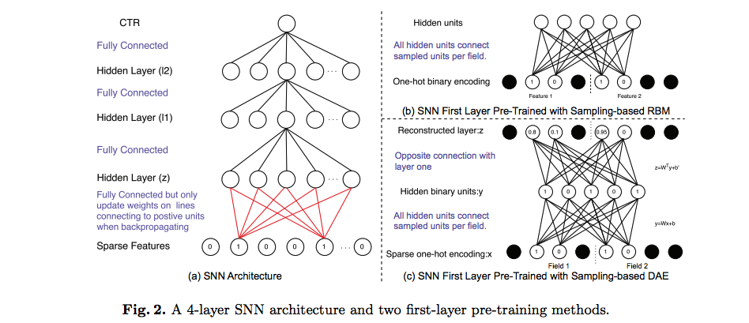
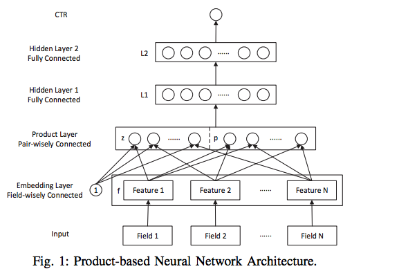
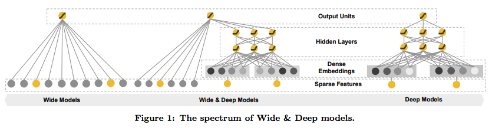
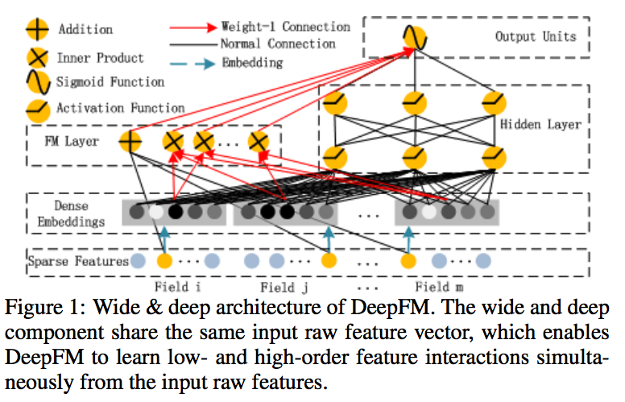
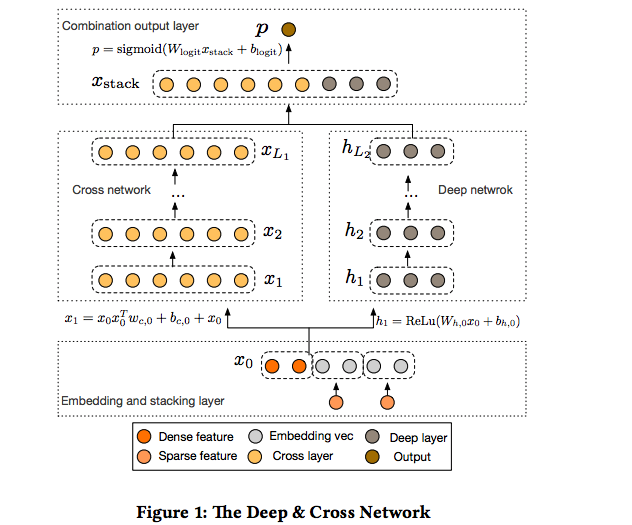
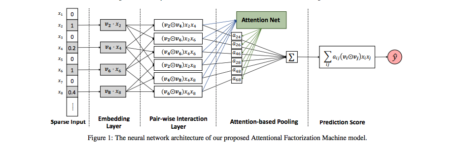

Recommender System Paper

|  Year | Category  | Title  |  
|---|---|---|
| ADKDD2014	  | System  | [Practical lessons from predicting clicks on ads at facebook](#adkdd2014)  |
| CIKM2015  | CNN  | [A Convolutional Click Prediction Model](#cikm2015)  |
| ECIR2016  | FM Neural Nets  | [Deep Learning over Multi-field Categorical Data: A Case Study on User Response Prediction](#ecir2016)  | 
| ICDM2016  | Product-based NN | [Product-based neural networks for user response prediction](#icdm2016)  |
| DLRS2016  | Wide & Deep  | [Wide & Deep Learning for Recommender Systems](#dlrs2016)
| IJCAI2017 | DeepFM  | [DeepFM: A Factorization-Machine based Neural Network for CTR Prediction](#ijcai2017) |
| ADKDD2017 | Deep&Cross NN | [Deep & Cross Network for Ad Click Predictions](#adkdd2017) |
| IJCAI2017-2 | Attentional FM | [Attentional Factorization Machines: Learning the Weight of Feature Interactions via Attention Network](#ijcai2017-2) | 

## <a id="adkdd2014">[Practical lessons from predicting clicks on ads at facebook](http://citeseerx.ist.psu.edu/viewdoc/download?doi=10.1.1.718.9050&rep=rep1&type=pdf)

* Leverage boosting tree for feature transform and feed to linear model.
* Use online data joiner to keep training data fresh.
* The importance of features are quantified as the total squared error reduction in the boosting tree.

    

## <a id="cikm2015">[A Convolutional Click Prediction Model](http://ir.ia.ac.cn/bitstream/173211/12337/1/A%20Convolutional%20Click%20Prediction%20Model.pdf)
Proposed the convolution click prediction model by leveraging the sequential behavioral information of the users. Each of the ad impression in the sequence is represented as an embedding $e_i$. Several convolution operations are applied to the input matrix $s$, then flexible pooling followed by another conv, pooling and finally a full connected layer.

    

## <a id="ecir2016">[Deep Learning over Multi-field Categorical Data: A Case Study on User Response Prediction](https://arxiv.org/pdf/1601.02376.pdf)

Proposed two model architectures, Factorization-machine supported Neural Network (FNN) and Sampling-based Neural Networks (SNN) to model the relationship of multi-fied categorical features beyond linearality. These two models are similar for most of the parts except the first 2 layers (input and first hidden). The categorical features are represented as one-hot encodings. 

For FNN, the first hidden layer neurons are only connected locally with the corresponding inputs in one field. This is to learn a low dimension representative of each category in a way similar to embeddings.

For SNN, the input layer and the first hidden layer are fully connected. Due to the hugh parameters between the first and second layers. The paper proposed two pre-training methods to learn the weights: sampling-based Restricted Boltzmann Machine (RBM) and sampling-based Denoising Auto-Encoder.

In summary, the major contribution of this paper is the proposed representative learning for the multi-field categorical features, including FM-like NN and RBM-NN and DAE-NN. All the three methods are aiming to effectively learn a low dimensional representative of the hugh input feature space.

    
    

## <a id="icdm2016">[Product-based neural networks for user response prediction](#icdm2016)

This is one paper focused on the representation learning of the input features before feeding to the neural nets. An embedding layer is leveraged to learning the dense representation (embedding) of the interactive patterns between intern-field categorical features. This embedding layer is used as the first layer of an architecture called Product-based Neural Networks (PNN) for end-to-end recommendation.

    

The model architecture proposed in this paper is an incremental updating from the architecture proposed in the [FNN](#ecir2016) paper. Instead of doing pre-training for the first hidden layer, PNN added the embedding layer to learn the low level representation of the input features.

## <a id="dlrs2016">[Wide & Deep Learning for Recommender Systems](https://arxiv.org/pdf/1606.07792.pdf)

This paper proposed a new model architecture for the recommender systems, wide & deep. The wide part and deep part are feed to one common logistic loss function and are trained jointly.

The wide part is a linear model that learns the relationship between features using cross-product, acting as the memorizer of the system. The features feed to the linear model include raw input features and transformed features, e.g. cross-product transformation.

The deep part is a DNN model that tries to learn a general representation of the input features.

    

## <a id="ijcai2017">[DeepFM: A Factorization-Machine based Neural Network for CTR Prediction](https://www.ijcai.org/Proceedings/2017/0239.pdf)

This paper proposed a model called DeepFM that natively integrate FM with DNN that provides and e2e CTR prediction. DeepFM has the advantages of capturing both the low-level feature interactions (dot-product) like FM and capturing the high-level feature interactions like DNN, without manually crafted feature engineering like other model architectures.

In summary, this paper combines the architecture of FNN and Wide&Deep by replacing the Wide part with PNN. Another change is that instead of directly feeding the raw features to the FM layer, it feeds the raw features to the embedding layer. Then the output of embedding layer would be shared by the FM and the DNN.

    

## <a id="adkdd2017"> [Deep & Cross Network for Ad Click Predictions](https://arxiv.org/pdf/1708.05123.pdf)

This paper proposed Deep & Cross Network that integrate the traditional DNN with a Cross-network. The network is able to learn the feature interactions at a certain bounded degree, to achieve efficiency advantages over the traditional DNN.

From the architecture perspective, this paper is a variant of FM NN and the Wide & Deep NN. It replaced the Wide part with stacked crossed network that each layer is a cross product of the output of the previous layer and the embedding and stacking layer. This make the network to be able to learn the lth-degree cross product of the input features.

    

## <a id="ijcai2017-2"> [Attentional Factorization Machines: Learning the Weight of Feature Interactions via Attention Networks](https://www.ijcai.org/Proceedings/2017/0435.pdf)

This paper proposed the attentional FM to address the issue of negative impact of noisy feature interactions of the vanilla FM. Essentially, an attention network (MLP) is added and provides extra weights to quantify the importance of each of the pairwise feature interactions. $\hat{y} = \sum_{(i,j)\in R_x} a_{ij}(v_i \odot v_j)x_i x_j$, where $a_{ij}$ is the weight of the interactions obtained by feeding the interactions of feature i, j to the attention network, i.e. $a'_{ij} = h^T ReLU(W (v_i \odot v_j) x_i x_j + b)$ and $a_{ij} = softmax(a'_{ij})$.

From the model training perspective, in addition to learn the weights of the FM, the weights of the attention network
also needs to be learnt.

    

