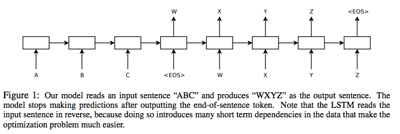
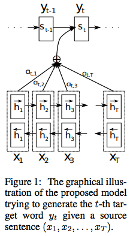
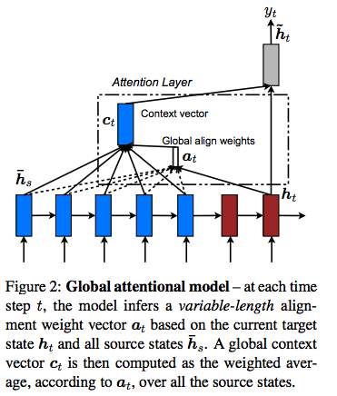
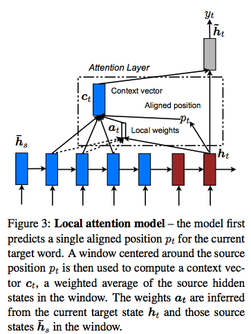
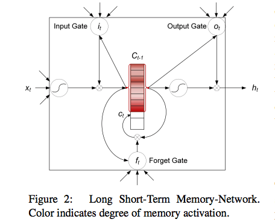

Sequential Learning Paper

|  Year | Category  | Title  |  
|---|---|---|
| NIPS2014	  | Seq2Seq with RNN  | [Sequence to Sequence Learning with Neural Networks](#nipsd2014)  |
| ICLR2015  | Attention and bi-RNN  | [Neural Machine Translation by Jointly Learning to Align and Translate](#iclr2015)  |
| ICML2015 | Hard and Soft attention | [Show, attend and tell: neural image caption generation with visual attention](#icml2015) |
| EMNLP2015 | Attention based NMT | [Effective Approaches to Attention-based Neural Machine Translation](#emnlp2015) |
| ACL2016  | Self-attention with LSTM  | [Long Short-Term Memory-Networks for Machine Reading](#acl2016)  | 
| ICML2017 | Positional Encoding | [Convolutional Sequence to Sequence Learning](#icml2017) |
| NIPS2017  | Transformer with multi-head attention | [Attention Is All You Need](#nips2017)  |
| 2018    | GPT-1 | [Improving Language Understanding by Generative Pre-Training](#gpt1) |
| NAACL-HLT2019 | BERT | [BERT: Pre-training of Deep Bidirectional Transformers for Language Understanding](#naacl2019) |
| 2019 | GPT-2 | [ Language models are unsupervised multitask learners](#gpt2) |
| NIPS2020 | GPT-3 | [Language Models are Few-Shot Learners](#nips2020) |

## <a id="nips2014">[Sequence to Sequence Learning with Neural Networks](https://papers.nips.cc/paper/5346-sequence-to-sequence-learning-with-neural-networks.pdf)

Proposed neural machine translation and proposed the encoding/decoding architecture. The input first go through an encoder (Multilayer LSTM) to encode the information into a fixed length memory, then the information in the fixed length memory are feed to the decoder to get the output. Additionally, the model was feed with input sentence in the reverse order. The argument is that the reverse order can make it easy for SGD to "establish communication" between the input and the output. **This could be true for later words in the input sentence, but the information of the earlier words will loss even more, as they are further from the targets. However, the overall benefits are larger than the drawbacks.**

    

## <a id="iclr2015">[Neural Machine Translation by Jointly Learning to Align and Translate](https://arxiv.org/pdf/1409.0473.pdf)

Address the limitation of fixed length memory by extend the memory storage with an attention network (a feed forward net with 1 hidden layer). Additionally, both encoder/decoder are using bi-directional RNN to provide both the pre-context and post-context of the current target.

The output of the network is quantified as $g(y_{i-1}, s_i, c_i)$, where $s_i$ is the hidden state of the decoder and $c_i$ is the context vector, which is calculated as the weighted sum of the hidden states of the encoders, i.e. $c_i = \sum_{j=1}^{T_x} \alpha_{ij} h_j$. $\alpha_{ij}$ is the weight of hidden state of encoder at time j respect to the output of the decoder at time i, which is quantified as $\alpha_{ij} = softmax(e_{ik}). $e_{ik}$ is the output of the attention network (a MLP) by feeding $s_{i-1}$ and $h_k$ $e_{ik} = a(s_{i-1}, h_k)$. 

    

## <a id="emnlp2015">[Effective Approaches to Attention-based Neural Machine Translation](https://www.aclweb.org/anthology/D15-1166.pdf)

Proposed the global and local attention and integrate them into NMT. 

For global attention, all the hidden state of the encoder are used when deriving the context vector $c_t$, i.e. $c_t = \frac{1}{n} \sum a_t \bar{h}_s$ ($\bar{h}_s$ as the source hidden state). 

The alignment vector $a_t$ is quantified as the alignment function $a_t(s) = \frac{exp(score(h_t, \bar{h}_s))}{\sum_{s'}exp(score(h_t, \bar{h}_s))}$, where $score(h_t, \bar{h}_s) = h_t^T \bar{h}_s$ (dot) or $h_t^T W_a \bar{h}_s$ (general) or $W_a [h_t; \bar{h}_s]$ (concat). Once obtained the context vector $c_t$, the attentional hidden state of the target $\tilde{h}_t = tanh(W_c [c_t; h_t])$, and the final output $p(y_t | y_{<t}, x) = softmax(W_s \tilde{h}_t)$.

For local attention, $c_t$ is derived as the weighted average of the set of source hidden states within the window $[p_t - D, p_t + D]$, where $p_t$ is the aligned position for target word at time $t$ as $p_t$. There are two ways of setting $p_t$: 1) Monotonic alignment (local-m) by simply set $p_t = t$. 2) Predictive alignment (local-p) by set $p_t = S * sigmoid(v^T_p tanh(W_p h_t))$, where $v^T_p$ and $W_p$ are the parameters. The weight of each source hidden state $\bar{h}_s$ is then quantified as $a_t(s) = align(h_t, \bar{h}_s) exp (-\frac{(s-p_t)^2}{2\sigma_2})$, where $\sigma = \frac{D}{2}$.

    
    

## <a id="icml2015">[Show, attend and tell: neural image caption generation with visual attention](https://www.aclweb.org/anthology/D15-1166.pdf)

TBA

## <a id="acl2016">[Long Short-Term Memory-Networks for Machine Reading](https://arxiv.org/pdf/1601.06733.pdf)

Addressed the limitations of recurrent NNs: 1) Gradient vanish/exploding; 2) Unable to keep long term memory for earlier input in the sequence; 3) No reasoning over structure and no explicit relationship information retained among input tokens.

Improved the LSTM by keep all the history of the cell states $C = (c_1,...,c_{t-1})$ and the hidden states $H=(h1,...,h_{t-1})$. And the new cell state and hidden state are calculated based on the entire history in a weighted sum approach, i.e. $\tilde{h_t} = \sum_{i=1}^{t-1} s_i^t h_i$, where $s^t_i = softmax(a_i^t)$ and $a^t_i = v^T tanh(W_h h_i + W_x x_t + W_{\tilde{h}}\tilde{h_{t-1}})$.

    

## <a id="icml2017">[Convolutional Sequence to Sequence Learning](https://arxiv.org/pdf/1705.03122.pdf)

Proposed a method that to conduct seq2seq learning entirely based on CNN. The benefit of leveraging CNN is to achieve the maximal parallelism during model training/inference. 

TBA

## <a id="nips2017">[Attention Is All You Need](http://papers.nips.cc/paper/7181-attention-is-all-you-need.pdf)

Abandon recurrent NN and only use feed forward and attention mechanism for feature extraction for sequential data.

TBA

## <a id="gpt1">[Improving Language Understanding by Generative Pre-Training](https://s3-us-west-2.amazonaws.com/openai-assets/research-covers/language-unsupervised/language_understanding_paper.pdf)

TBA

## <a id="naacl2019">[BERT: Pre-training of Deep Bidirectional Transformers for Language Understanding](https://www.aclweb.org/anthology/N19-1423.pdf)

TBA

## <a id="gpt1">[Language Models are Unsupervised Multitask Learners](https://cdn.openai.com/better-language-models/language_models_are_unsupervised_multitask_learners.pdf)

TBA

## <a id="nips2020">[Language Models are Few-Shot Learners](https://arxiv.org/pdf/2005.14165.pdf)

TBA